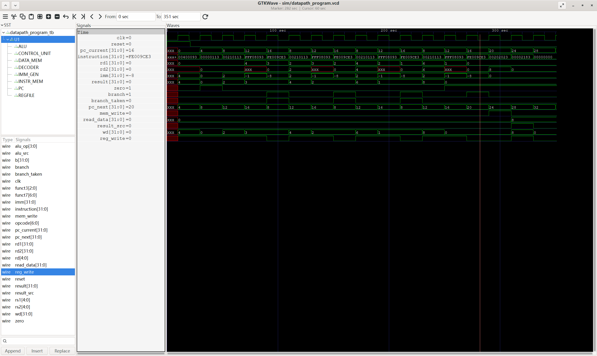

# Single-Cycle RISC-V CPU

A 32-bit single-cycle RISC-V CPU implemented in Verilog. The processor supports a subset of the RV32I instruction set, including arithmetic, logical, memory, and branch instructions.

The design consists of a program counter, instruction memory, decoder, control unit, register file, immediate generator, ALU, and data memory, integrated through a single-cycle datapath.

## Supported Instructions

The processor currently supports the following RV32I instructions:

| Type | Instructions | Function |
|------|--------------|----------|
| R-type | ADD, SUB | Integer addition and subtraction |
| R-type | AND, OR, XOR | Bitwise logical operations |
| R-type | SLT | Signed set-less-than comparison |
| I-type | ADDI | Addition with an immediate operand |
| I-type | LW | Load a 32-bit word from data memory |
| S-type | SW | Store a 32-bit word to data memory |
| B-type | BEQ, BNE | Conditional branch on equal or not equal |

## Modules

- **PC (`pc.v`)** — Stores the current program counter and updates it on each clock cycle.
- **Instruction Memory (`instr_mem.v`)** — Stores and outputs 32-bit instructions based on the current PC address.
- **Decoder (`decoder.v`)** — Extracts the opcode, register addresses, funct3, and funct7 fields from an instruction.
- **Control Unit (`control_unit.v`)** — Generates control signals according to the decoded instruction.
- **Register File (`regfile.v`)** — Contains 32 32-bit registers with two read ports and one write port.
- **Immediate Generator (`imm_gen.v`)** — Extracts and sign-extends immediate values for supported instruction formats.
- **ALU (`alu.v`)** — Performs arithmetic, logical, and comparison operations.
- **Data Memory (`data_mem.v`)** — Provides word-addressed data storage for load and store instructions.
- **Datapath (`datapath.v`)** — Integrates all components and implements data selection, write-back, and branch/PC update logic.

## Datapath Overview

The CPU uses a single-cycle datapath, where each instruction completes within one clock cycle.

The program counter selects an instruction from instruction memory. The instruction is decoded to obtain register addresses and control information. Register operands and immediate values are then provided to the ALU. Depending on the instruction, the ALU result can be used as an arithmetic result, a memory address, or part of a branch decision.

For load instructions, data read from data memory is written back to the register file. For arithmetic and logical instructions, the ALU result is written back directly. Branch instructions update the program counter based on the comparison result.

## Verification

Each major module is verified using a dedicated Verilog testbench located in the `tb/` directory. Integration-level testbenches are also included to verify the complete datapath.

The verification includes:

- Individual tests for the PC, instruction memory, decoder, immediate generator, register file, ALU, control unit, and data memory
- Datapath-level integration testing
- Execution of a small instruction program using `datapath_program_tb.v`
- Waveform inspection using GTKWave

Simulation is performed using Icarus Verilog (`iverilog` and `vvp`).

### Example Simulation Waveform

The following waveform shows the integrated datapath executing the test program:



## Project Structure

```text
RISC_V_CPU/
├── src/                    # Verilog RTL source files
│   ├── alu.v
│   ├── control_unit.v
│   ├── data_mem.v
│   ├── datapath.v
│   ├── decoder.v
│   ├── imm_gen.v
│   ├── instr_mem.v
│   ├── pc.v
│   └── regfile.v
│
├── tb/                     # Verilog testbenches
│   ├── alu_tb.v
│   ├── control_unit_tb.v
│   ├── data_mem_tb.v
│   ├── datapath_program_tb.v
│   ├── datapath_tb.v
│   ├── decoder_tb.v
│   ├── imm_gen_tb.v
│   ├── instr_mem_tb.v
│   ├── pc_tb.v
│   └── regfile_tb.v
│
├── docs/                   # Simulation results and documentation
│   └── datapath_program_waveform.png
│
├── .gitignore
└── README.md
```

## Tools

- Verilog HDL
- Icarus Verilog
- GTKWave
- Visual Studio Code

## Running the Simulation

The design can be compiled and simulated using Icarus Verilog. Simulation output files are generated locally in the `sim/` directory.

### Compile

From the project root directory:

```bash
iverilog -o sim/datapath_program_test src/*.v tb/datapath_program_tb.v
```

### Run

```bash
vvp sim/datapath_program_test
```

A successful simulation will generate `sim/datapath_program.vcd`.

### View Waveform

The generated VCD file can be inspected using GTKWave:

```bash
gtkwave sim/datapath_program.vcd
```